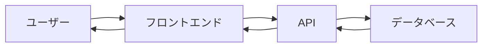

# [プロジェクト名] 設計書

最終更新: YYYY-MM-DD

## 概要

プロジェクトの目的、主要機能、対象ユーザーを簡潔に説明します。

### プロジェクトの目的
[このプロジェクトが解決する課題や提供する価値]

### 主要機能
- 機能1: [説明]
- 機能2: [説明]
- 機能3: [説明]

### 対象ユーザー
[想定するユーザー像]

---

## アーキテクチャ

### システム構成

#### フロントエンド
- フレームワーク: [例: React 18.x]
- ビルドツール: [例: Vite]
- 言語: [例: TypeScript 5.x]

#### バックエンド（該当する場合）
- フレームワーク: [例: Express.js / ASP.NET Core]
- 言語: [例: Node.js / C#]
- データベース: [例: PostgreSQL / MongoDB]

### 主要なライブラリとバージョン

| ライブラリ | バージョン | 用途 |
|-----------|-----------|------|
| [例: React Router] | [例: 6.x] | [例: ルーティング] |
| [例: Zustand] | [例: 4.x] | [例: 状態管理] |

### ディレクトリ構成

```
src/
├── components/         # UIコンポーネント
│   ├── common/        # 共通コンポーネント
│   └── features/      # 機能別コンポーネント
├── hooks/             # カスタムフック
├── services/          # API通信、外部サービス連携
├── utils/             # ユーティリティ関数
├── types/             # 型定義
├── constants/         # 定数定義
└── styles/            # スタイル関連
```

---

## データモデル

### 主要なエンティティ

#### [エンティティ名1]
```typescript
interface User {
  id: string;
  name: string;
  email: string;
  createdAt: Date;
  updatedAt: Date;
}
```

#### [エンティティ名2]
```typescript
interface Product {
  id: string;
  name: string;
  price: number;
  category: string;
}
```

### データフロー



---

## 機能一覧

### 実装済み機能

#### 1. [機能名1]
- **概要**: [機能の説明]
- **実装場所**: `src/components/features/[機能名]/`
- **主要なファイル**:
  - `[ファイル名].tsx` - [役割]
  - `use[機能名].ts` - [役割]
- **依存関係**: [他機能との関連]
- **状態管理**: [使用している状態管理方法]

#### 2. [機能名2]
- **概要**: [機能の説明]
- **実装場所**: `src/components/features/[機能名]/`
- **主要なファイル**:
  - `[ファイル名].tsx` - [役割]
- **依存関係**: なし

### 未実装機能（予定）

- [ ] [機能名]: [概要]
- [ ] [機能名]: [概要]

---

## API設計（該当する場合）

### エンドポイント一覧

#### GET /api/users
- **説明**: ユーザー一覧を取得
- **認証**: 必要
- **リクエスト**: なし
- **レスポンス**:
```json
{
  "users": [
    {
      "id": "string",
      "name": "string",
      "email": "string"
    }
  ]
}
```

#### POST /api/users
- **説明**: ユーザーを作成
- **認証**: 必要
- **リクエスト**:
```json
{
  "name": "string",
  "email": "string"
}
```
- **レスポンス**:
```json
{
  "id": "string",
  "name": "string",
  "email": "string"
}
```

### 認証・認可

- **認証方式**: [例: JWT / OAuth 2.0]
- **トークン保存**: [例: localStorage / httpOnly Cookie]
- **認可**: [例: ロールベース / 属性ベース]

---

## 状態管理

### グローバル状態

- **管理方法**: [例: Context API / Zustand / Redux]
- **管理対象**:
  - ユーザー情報（認証状態）
  - アプリケーション設定
  - 通知・アラート

### ローカル状態

- **管理方法**: useState / useReducer
- **管理対象**: コンポーネント固有の一時的な状態

### データ取得・キャッシング

- **ライブラリ**: [例: React Query / SWR]
- **キャッシング戦略**: [例: stale-while-revalidate]

---

## パフォーマンス考慮事項

### 最適化のポイント

1. **コンポーネントの最適化**
   - React.memo の使用
   - useMemo / useCallback の適切な使用
   - 仮想化リストの導入（大量データ表示時）

2. **バンドルサイズの最適化**
   - コード分割（React.lazy / Suspense）
   - Tree shaking の活用
   - 不要な依存関係の削除

3. **レンダリング最適化**
   - 不要な再レンダリングの防止
   - 適切なキーの使用（リスト表示時）

### キャッシング戦略

- **API レスポンス**: [戦略]
- **静的アセット**: [戦略]
- **計算結果**: useMemo を使用

---

## セキュリティ考慮事項

### 認証・認可

- [実装している認証方式]
- [権限管理の方法]

### 入力検証

- フロントエンド: [バリデーションライブラリ]
- バックエンド: [バリデーション方法]

### XSS対策

- HTMLのサニタイズ: [使用ライブラリ]
- dangerouslySetInnerHTML の使用制限

### CSRF対策

- [実装している対策]

### その他

- HTTPS の使用
- Content Security Policy の設定
- 依存パッケージの脆弱性チェック（npm audit）

---

## テスト戦略

### 単体テスト

- **フレームワーク**: [例: Vitest / Jest]
- **対象**: ユーティリティ関数、カスタムフック
- **カバレッジ目標**: 80%以上

### コンポーネントテスト

- **ライブラリ**: [例: React Testing Library]
- **対象**: UI コンポーネント
- **重点**: ユーザー操作のシミュレーション

### E2Eテスト

- **ツール**: [例: Playwright / Cypress]
- **対象**: 主要なユーザーフロー
- **実施タイミング**: デプロイ前

### テストデータ

- **モックデータ**: [管理方法]
- **テスト環境**: [構成]

---

## デプロイメント

### ビルドプロセス

```bash
# 本番ビルド
npm run build

# プレビュー
npm run preview
```

### デプロイ先

- **本番環境**: [例: Vercel / Netlify / AWS S3]
- **ステージング環境**: [URL]

### CI/CD

- **ツール**: [例: GitHub Actions / GitLab CI]
- **自動実行**:
  - リント・テスト実行
  - ビルド確認
  - 自動デプロイ（main ブランチマージ時）

### 環境変数

| 変数名 | 説明 | 例 |
|-------|-----|-----|
| `VITE_API_URL` | APIのベースURL | `https://api.example.com` |
| `VITE_AUTH_DOMAIN` | 認証ドメイン | `auth.example.com` |

---

## 既知の問題・制限事項

### 技術的負債

- [問題の説明]
  - **影響範囲**: [影響するファイル・機能]
  - **対処予定**: [対処方法・時期]

### パフォーマンスボトルネック

- [ボトルネックの説明]
  - **影響**: [パフォーマンスへの影響]
  - **回避策**: [現在の回避策]

### ブラウザ互換性

- **対応ブラウザ**: [例: Chrome 最新版、Firefox 最新版、Safari 最新版]
- **既知の問題**: [特定ブラウザでの問題]

---

## 今後の改善案

### リファクタリング計画

- [ ] [改善項目]: [詳細]
- [ ] [改善項目]: [詳細]

### 機能拡張案

- [ ] [新機能案]: [概要]
- [ ] [新機能案]: [概要]

### パフォーマンス改善

- [ ] [改善案]: [期待される効果]
- [ ] [改善案]: [期待される効果]

---

## 参考資料

- [公式ドキュメント](URL)
- [設計ドキュメント](URL)
- [関連Issue](URL)
